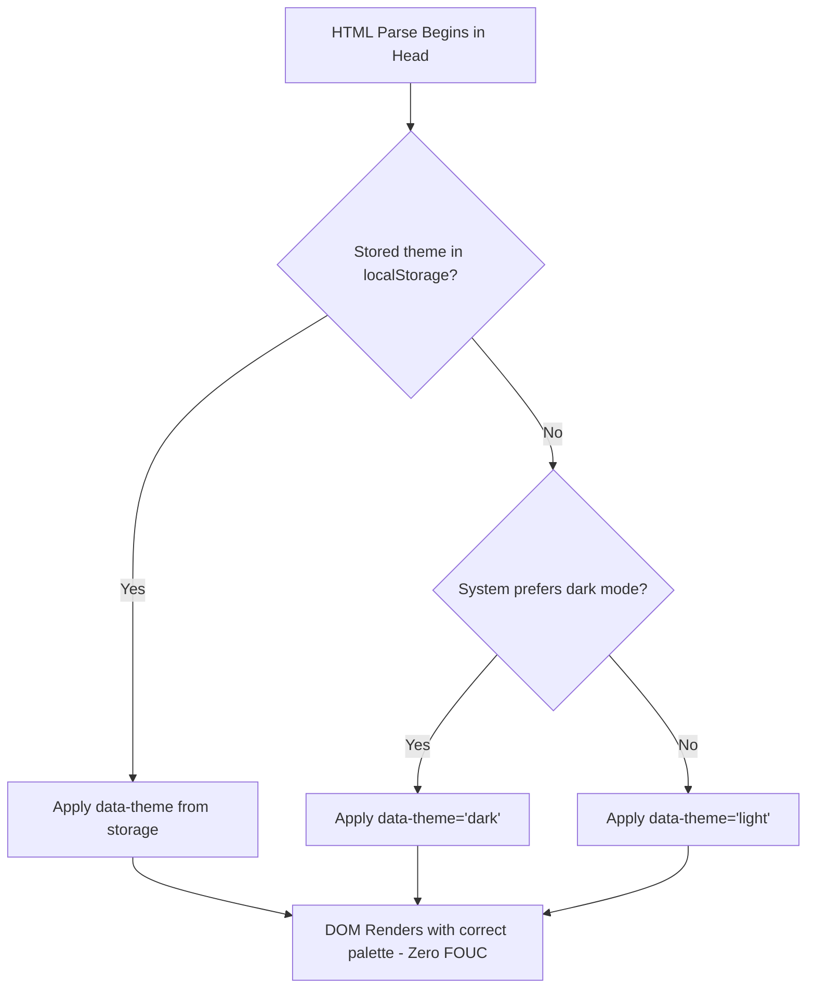
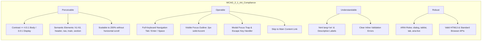

# System Architecture & Technical Specification
## Warm Architectural Editorial Portfolio

**Document Version:** 1.0.0  
**Status:** Approved for Implementation  
**Standard References:** [PRD.md](file:///c:/Users/jsash/Desktop/Projects/Demo%20Portfolio/PRD.md), [RULES.md](file:///c:/Users/jsash/Desktop/Projects/Demo%20Portfolio/RULES.md), [DESIGN Light.md](file:///c:/Users/jsash/Desktop/Projects/Demo%20Portfolio/DESIGN%20Light.md), [DESIGN Dark.md](file:///c:/Users/jsash/Desktop/Projects/Demo%20Portfolio/DESIGN%20Dark.md)

---

## 1. Architectural Principles & Overview

The portfolio is architected as an ultra-high performance, lightweight, client-rendered static web application. It rejects heavy modern runtime dependencies (React, Vue, Tailwind bundles) in favor of high-craft **Vanilla HTML5, Vanilla CSS3, and ES6+ JavaScript**.

### Key Architectural Pillars:
1. **Zero-Overhead Performance:** Instant initial render with near-zero runtime latency, sub-second LCP (<1.2s), and zero layout shifts (CLS < 0.05).
2. **Deterministic State & Zero-FOUC (Flash of Unstyled Content):** Theme state is resolved synchronously before initial paint.
3. **Design Token Hierarchy:** Centralized design system using CSS Custom Properties supporting seamless dual-theme orchestration.
4. **Accessible by Construction:** Strict WCAG 2.1 Level AA compliance integrated into the DOM semantics, keyboard navigation tree, and ARIA state management.

---

## 2. Directory & File Structure

```text
Demo Portfolio/
├── index.html              # Main semantic entry point & DOM structure
├── favicon.svg             # Minimalist architectural monogram favicon
├── assets/
│   ├── css/
│   │   ├── tokens.css      # Design tokens (colors, typography, radii, spacing)
│   │   ├── base.css        # Reset, typography definitions, base elements
│   │   ├── grid.css        # 12-column architectural drafting grid system
│   │   ├── components.css  # Buttons, cards, chips, form inputs, callouts
│   │   └── sections.css    # Header, Hero, Projects, Skills, Timeline, Footer
│   ├── js/
│   │   ├── theme.js        # Instant theme resolver (injected in <head>)
│   │   ├── app.js          # Core app lifecycle & navigation controller
│   │   ├── projects.js     # Project filtering, modal management, data store
│   │   └── form.js         # Inquiry form validation & feedback notifications
│   └── data/
│       └── projects.json   # Structured project case studies & metadata
├── DESIGN Light.md         # Light theme design tokens & specifications
├── DESIGN Dark.md          # Dark theme design tokens & specifications
├── PRD.md                  # Product Requirements Document
├── RULES.md                # Engineering, design & WCAG compliance rules
├── ARCHITECTURE.md         # System Architecture & Technical Design (This file)
└── PHASES.md               # Phased Implementation Roadmap & Verification Plan
```

---

## 3. Data Architecture & Schema

All case study content, architectural spec sheets, and project records are maintained in a clean, schema-validated structure. This ensures maintainability and allows adding or updating projects without touching presentation markup.

### 3.1 Project Entity Schema (`projects.json`)
```typescript
interface Project {
  id: string;                      // Unique slug (e.g. "ai-doc-architect")
  title: string;                   // Display title
  category: "web" | "ai" | "security" | "systems"; // Primary category
  tagline: string;                 // High-impact editorial subline
  description: string;             // Executive summary (Manrope body)
  highlights: string[];            // 2-3 key technical outcomes
  aiLeverage: string;              // Transparent breakdown of AI tools & workflow
  stack: string[];                 // Tech stack badges (e.g. ["Python", "OpenAI", "Node"])
  metrics: { [key: string]: string }; // Measurable impact (e.g. { "Latency": "120ms" })
  links: {
    demo?: string;                 // Live deployment link
    github?: string;               // Source repository link
  };
  caseStudy: {
    challenge: string;             // Architectural constraint / problem statement
    architecture: string;          // System design & trade-offs made
    solution: string;              // Implemented engineering solution
    learnings: string;             // Lessons learned and future improvements
  };
}
```

---

## 4. Design System & CSS Token Architecture

CSS is structured in cascading layers. At the foundation is `tokens.css`, defining theme variables toggled via `data-theme="light"` or `data-theme="dark"` on the `<html>` root element.

```css
/* Architecture of tokens.css */
:root {
  /* Shared Structural Tokens */
  --font-display: 'Newsreader', Georgia, serif;
  --font-body: 'Manrope', -apple-system, BlinkMacSystemFont, sans-serif;
  --container-max: 76rem; /* 1216px */
  --radius-sm: 0.25rem;   /* 4px */
  --radius-md: 0.5rem;    /* 8px */
  --ease-tactile: cubic-bezier(0.16, 1, 0.3, 1);
  --duration-fast: 150ms;
}

/* Light Theme Variables */
[data-theme="light"] {
  --canvas-bg: #FBF8F3;
  --canvas-sunken: #F7F3EB;
  --surface-card: #F2ECE1;
  --surface-card-hover: #EDE5D8;
  --ink-primary: #231B15;
  --ink-body: #4A3E36;
  --ink-muted: #706259;
  --accent: #B58D3D;
  --accent-pressed: #9E792D;
  --hairline: #E4DCD0;
  --shadow-ambient: 0 1px 3px rgba(35, 27, 21, 0.04), 0 1px 1px rgba(35, 27, 21, 0.02);
}

/* Dark Theme Variables */
[data-theme="dark"] {
  --canvas-bg: #131411;
  --canvas-sunken: #0e0e0c;
  --surface-card: #20201D;
  --surface-card-hover: #2A2A27;
  --ink-primary: #E5E2DD;
  --ink-body: #D1C4BD;
  --ink-muted: #998F88;
  --accent: #EDC06A;
  --accent-pressed: #ECC06C;
  --hairline: #353532;
  --shadow-ambient: 0 1px 3px rgba(0, 0, 0, 0.3), 0 1px 1px rgba(0, 0, 0, 0.2);
}
```

---

## 5. Core Subsystem Architecture

### 5.1 FOUC-Free Theme Orchestration
To guarantee zero flash of light/dark background during page loading:
1. An inline script in `<head>` immediately queries `localStorage.getItem('portfolio-theme')`.
2. If absent, it queries `window.matchMedia('(prefers-color-scheme: dark)').matches`.
3. Sets `document.documentElement.setAttribute('data-theme', theme)` before DOM rendering begins.
4. An interactive toggle button switches themes and dispatches an `aria-live="polite"` status message for assistive tech.



### 5.2 12-Column Architectural Grid Engine (`grid.css`)
- **Container:** Centered with max-width `76rem` (`1216px`), applying horizontal safety paddings.
- **Breakpoints:**
  - **Desktop (≥ 1024px):** 12 columns, `1.5rem` (24px) gutters, 48px outer margin. Supports asymmetrical layouts (e.g., 4-col summary sidebar + 8-col case study canvas).
  - **Tablet (768px – 1023px):** 8 columns, `1.25rem` (20px) gutters, 32px outer margin.
  - **Mobile (< 768px):** 4 fluid columns, `1rem` (16px) gutters, 20px outer margin.

### 5.3 Interactive Filtering & Case Study Modal Subsystem (`projects.js`)
- **Dynamic Category Filtering:** Projects are tagged by category (`web`, `ai`, `security`, `all`). Tab clicks switch the active filter without page reload using standard DOM transitions.
- **Accessible Modal Dialog (`role="dialog"`):**
  - Triggered by clicking "Read Architectural Case Study".
  - **Focus Trap:** Keyboard focus is trapped within the active modal until closed.
  - **Escape & Backdrop Handling:** Closes on `Escape` keypress or clicking the backdrop.
  - **Focus Restoration:** Restores focus to the triggering element upon closure.
  - Prevents background body scrolling (`overflow: hidden` on `<body>`).

### 5.4 Form Subsystem & Validation (`form.js`)
- **Field Validation:** Live validation on blur and submit (Name, valid Email format, Message length).
- **Accessible Feedback:** Dynamic error messages associated via `aria-describedby` and `aria-invalid="true"`.
- **One-Click Email Copy:** Clipboard utility with visual feedback ("Copied to clipboard") and screen reader notification via `aria-live="polite"`.

---

## 6. Accessibility & WCAG 2.1 AA Architecture



---

## 7. Performance & Optimization Architecture

1. **Font Strategy:** 
   - Google Fonts loaded with `<link rel="preconnect">` to `fonts.googleapis.com` and `fonts.gstatic.com`.
   - `font-display: swap` prevents FOIT (Flash of Invisible Text).
2. **Asset Minimization:** Inline SVG icons for vector perfection at zero network latency.
3. **Motion Optimization:**
   ```css
   @media (prefers-reduced-motion: reduce) {
     *, *::before, *::after {
       animation-duration: 0.01ms !important;
       animation-iteration-count: 1 !important;
       transition-duration: 0.01ms !important;
       scroll-behavior: auto !important;
     }
   }
   ```
4. **Target Metrics:** 100/100 across Accessibility, Best Practices, and SEO; 95+ on Performance.
