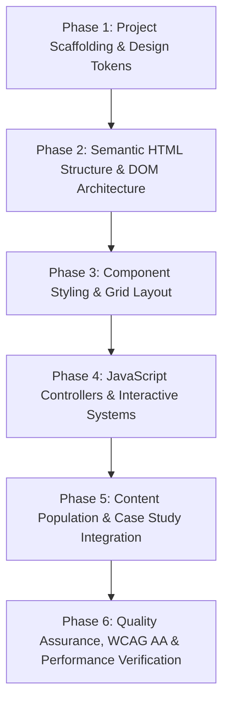

# Implementation Phases & Execution Roadmap
## Warm Architectural Editorial Portfolio

**Document Version:** 1.0.0  
**Status:** Approved for Execution  
**Standard References:** [PRD.md](file:///c:/Users/jsash/Desktop/Projects/Demo%20Portfolio/PRD.md), [RULES.md](file:///c:/Users/jsash/Desktop/Projects/Demo%20Portfolio/RULES.md), [ARCHITECTURE.md](file:///c:/Users/jsash/Desktop/Projects/Demo%20Portfolio/ARCHITECTURE.md)

---

## 1. Execution Overview

This roadmap defines the step-by-step technical execution strategy to build, style, integrate, and verify the portfolio. Each phase contains clear deliverables, technical steps, and verification gates.

---

## Phase 1: Project Scaffolding & Design Tokens

### Objective
Establish the directory structure, base files, and translate all design specifications from `DESIGN Light.md` and `DESIGN Dark.md` into reusable CSS tokens.

### Deliverables & Tasks
- [ ] **Directory Scaffolding:** Create `assets/css/`, `assets/js/`, `assets/data/`, and root files.
- [ ] **CSS Token Engine (`assets/css/tokens.css`):**
  - Define light theme variables: Ivory background (`#FBF8F3`), Espresso headline ink (`#231B15`), Walnut body ink (`#4A3E36`), Linen containers (`#F2ECE1`), Antique Brass accent (`#B58D3D`), and Hairline dividers (`#E4DCD0`).
  - Define dark theme variables: Warm Obsidian background (`#131411`), Cream headline ink (`#E5E2DD`), Neutral body ink (`#D1C4BD`), Deep container (`#20201D`), and Muted Gold accent (`#EDC06A`).
  - Configure structural tokens: corner radii (4px / 8px), container max width (`76rem` / 1216px), and transition timings.
- [ ] **Base Typography & Reset (`assets/css/base.css`):**
  - Reset styles with `box-sizing: border-box`.
  - Import Google Fonts (`Newsreader` optical serif and `Manrope` sans-serif) with `font-display: swap`.
  - Setup typographic scale classes (`display-lg`, `headline-md`, `body-lg`, `body-md`, `label-caps`).
- [ ] **Zero-FOUC Theme Script (`assets/js/theme.js`):**
  - Build synchronous theme detector reading `localStorage` and `prefers-color-scheme`.

### Verification Gate
- Open `index.html` with theme script loaded; verify theme attribute (`data-theme="light"` or `data-theme="dark"`) is set instantaneously before body paint.

---

## Phase 2: Semantic HTML Structure & DOM Architecture

### Objective
Build the complete HTML5 document tree with strict semantic elements, accessibility attributes, and content placeholders according to the PRD.

### Deliverables & Tasks
- [ ] **Accessibility Skip Link:** Add `#main-content` skip link as the first child of `<body>`.
- [ ] **Header (`<header>`):**
  - Wordmark/monogram in Newsreader italic.
  - Live availability badge ("Open to internships & junior roles").
  - Desktop & mobile navigation (`<nav>`) with links to `#projects`, `#skills`, `#experience`, `#about`, `#contact`.
  - Theme toggle button with `aria-label` and SVG icons.
  - Resume view/download button.
- [ ] **Hero Section (`<section id="hero">`):**
  - Editorial headline and narrative positioning statement (AI + Web Development + Cybersecurity).
  - Quick-spec architectural matrix (role, focus, location, availability).
  - Dual primary and outline CTAs.
- [ ] **Projects Section (`<section id="projects">`):**
  - Category filter tabs (`role="tablist"`) for All, Web Development, AI Applications, Cybersecurity/Systems.
  - Dynamic project grid container (`role="tabpanel"`).
- [ ] **Skills & Architecture Section (`<section id="skills">`):**
  - Spec lists with clean hairline rows for Languages, AI Engineering, Cybersecurity, and Tools.
- [ ] **Education & Milestones Section (`<section id="experience">`):**
  - Chronological 2-column layout for academic background and milestone achievements.
- [ ] **About & Philosophy Section (`<section id="about">`):**
  - Editorial narrative + antique brass left-border blockquote callout.
- [ ] **Contact Section (`<section id="contact">`):**
  - Direct email block with one-click copy button.
  - Interactive contact form with proper `<label>` elements and validation containers.
- [ ] **Footer & Colophon (`<footer>`):**
  - Typography credits, design system version, copyright, and back-to-top anchor.
- [ ] **Accessible Case Study Modal (`<dialog id="project-modal">`):**
  - Semantic container for deep-dive architectural breakdowns with close button.

### Verification Gate
- Validate HTML structure using W3C markup validator rules; verify logical heading progression (`h1` -> `h2` -> `h3`).

---

## Phase 3: Component Styling & Grid Layout

### Objective
Implement the 12-column architectural drafting grid and style all UI components to match the warm, tactile, print-editorial aesthetic.

### Deliverables & Tasks
- [ ] **12-Column Grid System (`assets/css/grid.css`):**
  - Max-width `76rem` container with centered alignment.
  - CSS Grid with 12 columns desktop, 8 columns tablet, 4 columns mobile.
  - Asymmetrical column utility spans (`col-4`, `col-8`, `col-6`, etc.).
- [ ] **Core Components (`assets/css/components.css`):**
  - **Buttons:** Primary solid (`#231B15` with ivory text, gold hover ring), Secondary outline, and Ghost.
  - **Cards:** Linen container with 1px hairline border, 8px radius, subtle ambient hover lift.
  - **Chips / Badges:** 4px radius, `label-caps` tracking, contrast compliant.
  - **Form Controls:** Clean input fields with antique brass focus ring (`outline: 2px solid var(--accent)`).
  - **Editorial Callout:** 2px solid left accent border, Newsreader italic font.
  - **Modal Sheet:** Centered dialog with backdrop blur/darkening and hairline border.
- [ ] **Section Styling (`assets/css/sections.css`):**
  - Refined margins and rhythm (discipline of 4px multiples; 48px–72px section vertical clearance).
  - Mobile menu drawer styling and responsive overrides.

### Verification Gate
- Visual inspection in browser across viewports: Desktop (1440px), Laptop (1024px), Tablet (768px), and Mobile (375px). No horizontal overflow.

---

## Phase 4: JavaScript Controllers & Interactive Systems

### Objective
Implement lightweight, dependency-free JavaScript controllers for theme toggling, project filtering, modal dialogs, form handling, and clipboard actions.

### Deliverables & Tasks
- [ ] **Theme Controller (`assets/js/theme.js`):**
  - Toggle between Light and Dark mode.
  - Sync with `localStorage` and system preference changes.
  - Announce theme status to screen readers via `aria-live="polite"`.
- [ ] **Projects & Case Study Controller (`assets/js/projects.js`):**
  - Load and render projects from `assets/data/projects.json`.
  - Filter projects dynamically based on category tabs with smooth opacity transitions.
  - Open modal dialog with full architectural case study content.
  - Trap keyboard focus inside modal and close on `Escape` key or backdrop click.
- [ ] **Form & Clipboard Controller (`assets/js/form.js`):**
  - Handle form input validation (email syntax, non-empty fields) with inline accessible error states.
  - Copy email to clipboard on one-click with visual tooltip feedback and ARIA live announcement.
- [ ] **Navigation & Scroll Spy (`assets/js/app.js`):**
  - Highlight active nav link on scroll using `IntersectionObserver`.
  - Mobile hamburger toggle for navigation menu.

### Verification Gate
- Manual functional test: Filter projects, open/close modal via keyboard (`Tab` + `Esc`), copy email, submit form with invalid and valid inputs, toggle themes.

---

## Phase 5: Content Population & Case Study Integration

### Objective
Populate `assets/data/projects.json` and page content with authentic, impressive, and accurately positioned project case studies reflecting AI leverage, web development, and cybersecurity.

### Deliverables & Tasks
- [ ] **Project Data Creation (`assets/data/projects.json`):**
  - **Project 1 (AI + Web):** Intelligent Document / Code Analysis Engine (LLM API integration, vector indexing, clean UI).
  - **Project 2 (Web Development):** Full-Stack Web Application / SaaS Dashboard (REST/GraphQL APIs, reactive state, authentication).
  - **Project 3 (Cybersecurity / Systems):** Security Vulnerability Scanner / Network Tool (OWASP Top 10 auditing, packet/header inspector, reporting).
  - **Project 4 (Creative Tool / Open Source):** Developer Productivity Extension or CLI Utility.
- [ ] **Educational Milestones & Skills:** Fill in accurate technical skills across all domains and academic credentials.
- [ ] **Editorial Narrative:** Polish the "About" and "Philosophy" sections with mature, authoritative copy.

### Verification Gate
- Verify that every project displays real problem statements, architectural decisions, measurable metrics, and transparent AI toolchain notes.

---

## Phase 6: Quality Assurance, WCAG AA & Performance Verification

### Objective
Conduct rigorous cross-browser, responsive, accessibility, and performance auditing to guarantee compliance with `RULES.md`.

### Deliverables & Tasks
- [ ] **WCAG 2.1 Level AA Accessibility Audit:**
  - Verify color contrast ratios: ≥ 4.5:1 for body copy, ≥ 3.0:1 for large display titles, ≥ 3.0:1 for interactive borders and focus indicators.
  - Test complete keyboard navigation loop (`Tab` through all links, buttons, inputs, and modals).
  - Verify all images/SVGs have proper `alt` or `aria-hidden` attributes.
  - Screen reader walkthrough (NVDA / VoiceOver / browser speech tool).
- [ ] **Performance & Web Vitals Audit:**
  - Run Lighthouse audit targeting 95–100 in Performance, 100 in Accessibility, 100 in Best Practices, and 100 in SEO.
  - Verify CLS < 0.05, LCP < 1.2s, INP < 50ms.
- [ ] **Motion & Device Compatibility:**
  - Test with `@media (prefers-reduced-motion: reduce)` enabled.
  - Validate layout stability on Chrome, Firefox, Safari, and Edge.

### Verification Gate
- 100% checklist passing in `RULES.md` and complete user sign-off.
